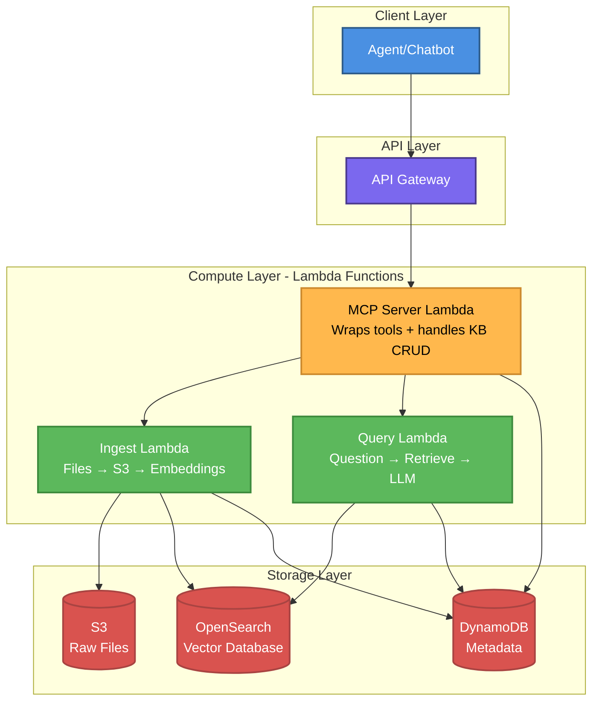
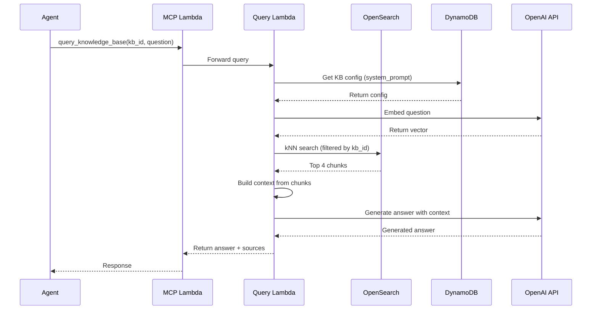
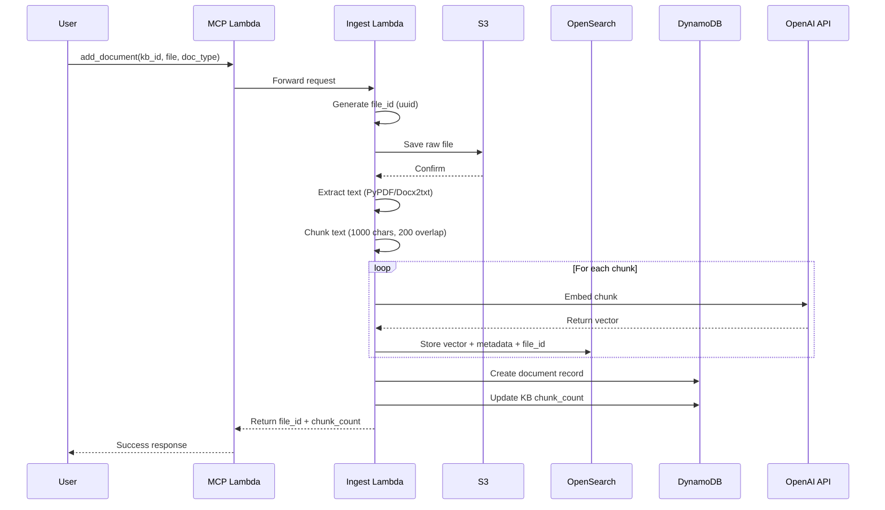
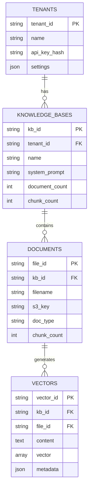
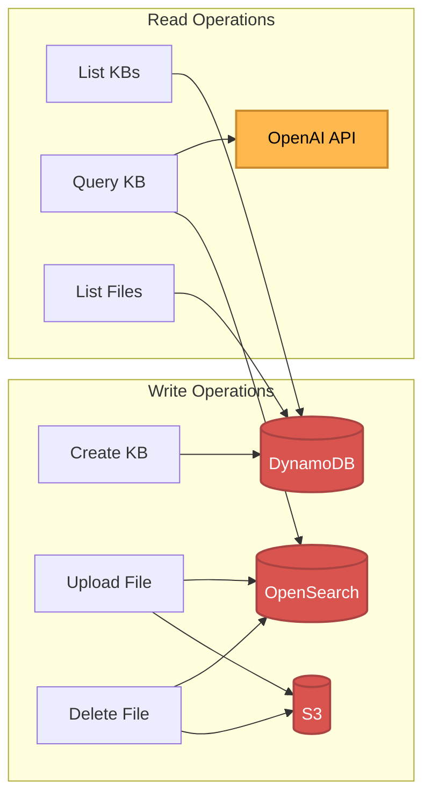

```mermaid
graph TB
    subgraph "Client Layer"
        Agent[Agent/Chatbot]
    end

    subgraph "API Layer"
        Gateway[API Gateway]
    end

    subgraph "Compute Layer - Lambda Functions"
        MCP[MCP Server Lambda<br/>Wraps tools + handles KB CRUD]
        Ingest[Ingest Lambda<br/>Files → S3 → Embeddings]
        Query[Query Lambda<br/>Question → Retrieve → LLM]
    end

    subgraph "Storage Layer"
        S3[(S3<br/>Raw Files)]
        OpenSearch[(OpenSearch<br/>Vector Database)]
        DynamoDB[(DynamoDB<br/>Metadata)]
    end

    Agent --> Gateway
    Gateway --> MCP

    MCP --> Ingest
    MCP --> Query
    MCP --> DynamoDB

    Ingest --> S3
    Ingest --> OpenSearch
    Ingest --> DynamoDB
    Query --> OpenSearch
    Query --> DynamoDB

    style Agent fill:#4A90E2,stroke:#2E5C8A,stroke-width:2px,color:#fff
    style Gateway fill:#7B68EE,stroke:#4B3A8E,stroke-width:2px,color:#fff
    style MCP fill:#FFB84D,stroke:#CC8A2E,stroke-width:2px,color:#000
    style Query fill:#5CB85C,stroke:#3D8B3D,stroke-width:2px,color:#fff
    style Ingest fill:#5CB85C,stroke:#3D8B3D,stroke-width:2px,color:#fff
    style OpenSearch fill:#D9534F,stroke:#A94442,stroke-width:2px,color:#fff
    style S3 fill:#D9534F,stroke:#A94442,stroke-width:2px,color:#fff
    style DynamoDB fill:#D9534F,stroke:#A94442,stroke-width:2px,color:#fff
```

## Query Flow (Detailed)

```mermaid
sequenceDiagram
    participant Agent
    participant MCP as MCP Lambda
    participant Query as Query Lambda
    participant OS as OpenSearch
    participant DB as DynamoDB
    participant LLM as OpenAI API

    Agent->>MCP: query_knowledge_base(kb_id, question)
    MCP->>Query: Forward query
    Query->>DB: Get KB config (system_prompt)
    DB-->>Query: Return config
    Query->>LLM: Embed question
    LLM-->>Query: Return vector
    Query->>OS: kNN search (filtered by kb_id)
    OS-->>Query: Top 4 chunks
    Query->>Query: Build context from chunks
    Query->>LLM: Generate answer with context
    LLM-->>Query: Generated answer
    Query-->>MCP: Return answer + sources
    MCP-->>Agent: Response
```

## Ingest Flow (Detailed)

```mermaid
sequenceDiagram
    participant User
    participant MCP as MCP Lambda
    participant Ingest as Ingest Lambda
    participant S3
    participant OS as OpenSearch
    participant DB as DynamoDB
    participant LLM as OpenAI API

    User->>MCP: add_document(kb_id, file, doc_type)
    MCP->>Ingest: Forward request
    Ingest->>Ingest: Generate file_id (uuid)
    Ingest->>S3: Save raw file
    S3-->>Ingest: Confirm
    Ingest->>Ingest: Extract text (PyPDF/Docx2txt)
    Ingest->>Ingest: Chunk text (1000 chars, 200 overlap)
    loop For each chunk
        Ingest->>LLM: Embed chunk
        LLM-->>Ingest: Return vector
        Ingest->>OS: Store vector + metadata + file_id
    end
    Ingest->>DB: Create document record
    Ingest->>DB: Update KB chunk_count
    Ingest-->>MCP: Return file_id + chunk_count
    MCP-->>User: Success response
```

## Data Model Relationships

```mermaid
erDiagram
    TENANTS ||--o{ KNOWLEDGE_BASES : has
    KNOWLEDGE_BASES ||--o{ DOCUMENTS : contains
    DOCUMENTS ||--o{ VECTORS : generates

    TENANTS {
        string tenant_id PK
        string name
        string api_key_hash
        json settings
    }

    KNOWLEDGE_BASES {
        string kb_id PK
        string tenant_id FK
        string name
        string system_prompt
        int document_count
        int chunk_count
    }

    DOCUMENTS {
        string file_id PK
        string kb_id FK
        string filename
        string s3_key
        string doc_type
        int chunk_count
    }

    VECTORS {
        string vector_id PK
        string kb_id FK
        string file_id FK
        text content
        array vector
        json metadata
    }
```

## Component Interactions

```mermaid
graph LR
    subgraph "Write Operations"
        W1[Create KB] --> DDB[(DynamoDB)]
        W2[Upload File] --> S3[(S3)]
        W2 --> OS[(OpenSearch)]
        W3[Delete File] --> S3
        W3 --> OS
    end

    subgraph "Read Operations"
        R1[List KBs] --> DDB
        R2[Query KB] --> OS
        R2 --> LLM[OpenAI API]
        R3[List Files] --> DDB
    end

    style DDB fill:#D9534F,stroke:#A94442,stroke-width:2px,color:#fff
    style S3 fill:#D9534F,stroke:#A94442,stroke-width:2px,color:#fff
    style OS fill:#D9534F,stroke:#A94442,stroke-width:2px,color:#fff
    style LLM fill:#FFB84D,stroke:#CC8A2E,stroke-width:2px,color:#000
```
